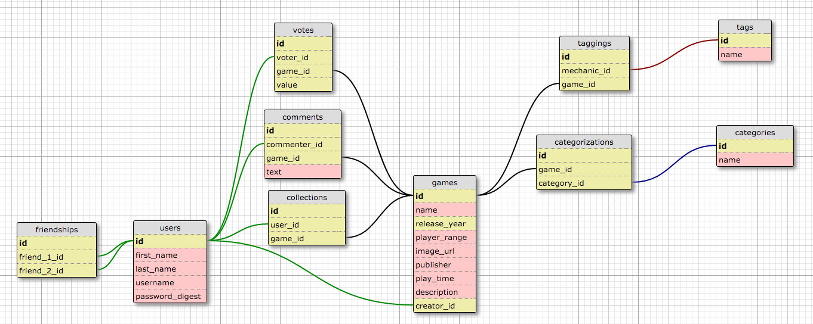

#boredGameZ

This README would normally document whatever steps are necessary to get the
application up and running.

Current Contributors: Alana Hanson, Tyler McKenzie, Eddie Glenn, Mike Klimek, Ray Curran, Taylor Swift

Things you may want to cover:

* Ruby version
  * Ruby version 2.0.0

* Configuration
  * bundle install 

* Database creation
  * be rake db:create
  * be rake db:migreate
  * be rake db:create

* How to run the test suite  
  * be rake

#Schema

